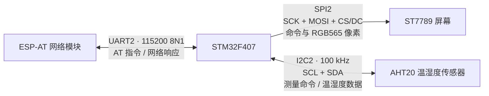

# 常见通信协议：UART、SPI、I2C、CAN、USB

## 一、30 秒总述

## 二、项目通信全链路



三条链路的方向不同：UART 与 ESP 双向收发；SPI 刷屏主要由 STM32 单向写入；I2C 先向 AHT20 写测量命令，再读回采集结果。

## 三、常见协议速查表

| 协议 | 时钟与线路 | 通信组织 | 项目用途/常见用途 | 关键优势 | 主要代价 |
| --- | --- | --- | --- | --- | --- |
| UART | 无时钟线；TX、RX、GND | 点对点、异步、全双工 | **项目：STM32 ↔ ESP-AT**；日志调试 | 简单、成本低 | 双方帧格式必须一致，通常不适合多节点 |
| SPI | SCK、MOSI、MISO、CS | 主从、同步、可全双工 | **项目：ST7789 刷屏**；Flash、ADC | 速率高、协议简单 | 每个从机通常需要独立 CS，没有统一 ACK |
| I2C | SCL、SDA，均开漏上拉 | 带地址的共享总线、半双工 | **项目：AHT20**；RTC、EEPROM | 两根线挂多个从机 | 速率和距离有限，依赖上拉与 ACK |
| CAN | CANH、CANL，经收发器连接 | 多主、差分、按报文 ID 仲裁 | 汽车电子、工业控制 | 抗干扰、仲裁和错误处理强 | 需要收发器、终端匹配，协议更复杂 |
| USB | D+、D-，另有电源和地 | 主机调度、设备枚举、端点传输 | 键鼠、U 盘、虚拟串口 | 标准化、速率和生态完善 | 协议栈复杂，不是简单点对点串口 |

### 选型快速回答

---

## 四、UART：项目实际用于 STM32 与 ESP-AT 通信

### 1. 基本原理

UART 是异步串行通信，没有独立时钟线。双方预先约定相同波特率和帧格式，接收端检测到起始位后，按波特率在每个数据位中间采样。

```text
空闲高电平 → 起始位 0 → 8 个数据位 → 可选校验位 → 停止位 1
```

- 起始位：通知接收端一帧开始，并提供采样对齐点。
- 数据位：承载实际数据，项目使用 8 位。
- 校验位：可检测部分传输错误，不能纠错；项目不使用校验。
- 停止位：标志一帧结束，并使线路恢复空闲高电平；项目使用 1 位。

`8N1` 表示 8 个数据位、无校验、1 个停止位。TX/RX 必须交叉连接：STM32 TX 接 ESP RX，STM32 RX 接 ESP TX；双方必须共地，才能对高低电平使用同一个参考电位。

### 2. 项目中怎么做

裸机版真实配置：

- 外设：`USART2`
- 引脚：`PA2`、`PA3`
- 波特率：`115200`
- 帧格式：8 数据位、无校验、1 停止位，即 `8N1`
- 收发：双向，无硬件流控

数据流：

```text
STM32 组织 AT 指令
  → UART 发送指令并追加 \r\n
  → ESP 执行联网、SNTP 或 HTTP 操作
  → UART 返回文本
  → STM32 累积到接收缓冲区
  → 按行匹配 OK、ERROR、busy、ready
  → 天气业务继续解析有效响应
```

裸机真源中，发送时轮询 `TXE`，接收时轮询 `RXNE` 并带超时；这是实际裸机口径。FreeRTOS 教程版进一步使用 UART TX DMA、RXNE 接收中断，并在识别到完整应答后由中断释放信号量唤醒等待任务；该部分只能表述为“教程工程的做法”。

### 3. UART 故障排查（重点）

1. 检查供电、共地和双方 IO 电平是否兼容。
2. 检查 TX/RX 是否交叉连接，是否接错串口和引脚复用。
3. 核对波特率、数据位、校验位、停止位是否完全一致。
4. 检查发送结尾是否符合 AT 指令要求，例如 `\r\n`。
5. 检查接收缓冲区、超时、分包和响应结束条件。

---

## 五、SPI：项目实际用于 ST7789 刷屏

### 1. 基本原理和硬件线

SPI 是由主机提供时钟的同步串行通信：

```text
SCK：主机输出时钟
MOSI：主机 → 从机
MISO：从机 → 主机
CS：片选，通常低电平选中从机
```

SPI 在结构上支持全双工，但项目刷屏只需 STM32 向 ST7789 写命令和像素，主要使用 MOSI，不需要屏幕通过 MISO 回传，也没有 I2C 那样的逐字节 ACK。

ST7789 还使用普通 GPIO：

- `CS`：选中屏幕。
- `DC`：区分 MOSI 当前传输的是命令还是数据。
- `RESET`：硬件复位屏幕。
- `BL`：控制背光。

### 2. CPOL、CPHA 和项目配置

- CPOL 决定 SCK 空闲时为高还是低。
- CPHA 决定在第一个还是第二个时钟边沿采样。
- 主从配置不一致时，接收端可能在数据变化瞬间采样，造成位错乱。

裸机真源使用 `SPI2`、8 位数据、MSB 先发、CPOL 低、第一边沿采样、软件管理 CS、时钟预分频 4。虽然代码把 SPI 配成双线全双工，实际显示路径只使用发送方向。

### 3. ST7789 的命令与像素关系

```text
CS=0，选中屏幕
  → DC=0，发送 0x2A，设置列范围
  → DC=1，发送 x 起点和终点
  → DC=0，发送 0x2B，设置行范围
  → DC=1，发送 y 起点和终点
  → DC=0，发送 0x2C，开始写显存
  → DC=1，连续发送 RGB565 像素
CS=1，结束传输
```

先设置窗口，是为了告诉控制器后续像素写入显存的坐标范围；随后发送的像素会从窗口左上角开始依次填入。

### 4. RGB565

一个 RGB565 像素为 16 bit，刚好 2 字节：

```text
R：5 bit    G：6 bit    B：5 bit
```

绿色多 1 bit，主要因为人眼对绿色亮度变化更敏感；同时 5+6+5 正好组成 16 bit，便于存储和传输。

### 5. SPI / ST7789 显示异常排查（重点）

1. 检查供电、共地、背光和复位。
2. 检查 CS、DC、SCK、MOSI 连线和有效电平。
3. 核对 SPI 时钟频率、CPOL、CPHA、位宽和高低位顺序。
4. 核对屏幕初始化命令、显示方向、显示窗口和 RGB565 像素格式。
5. 若使用 DMA，再检查源地址、长度、完成标志及上一笔传输是否结束。

---

## 六、DMA：配合 SPI 处理大块像素传输

DMA 是直接存储器访问控制器。它不负责发送 SPI 时钟，也不直接“发给屏幕”；它做的是把像素缓冲区中的数据自动搬到 SPI 数据寄存器，SPI 再从 MOSI 串行输出。

```text
像素缓冲区（内存）
  → DMA 连续搬运
  → SPI 数据寄存器
  → SPI 产生时钟、MOSI 输出
  → ST7789 显存
```

基线实现使用 CPU 轮询 SPI 状态发送数据；FreeRTOS 示例改为 SPI DMA，并在传输完成中断中释放信号量。

### 1. DMA 是搬运控制器，不是缓存区

DMA 是独立的数据搬运控制器，不是缓存区。CPU 负责配置 DMA 描述符或寄存器，包括源地址、目的地址、传输长度、方向、地址递增、数据宽度和完成中断；随后 DMA 在内存与外设、或内存与内存之间搬运数据，CPU 不需要逐字节参与。完成后 DMA 通过中断或状态位通知 CPU。

对 SPI 刷屏而言，像素缓冲区仍在内存中，DMA 只是按配置把它连续写入 SPI 数据寄存器；SPI 再负责产生时钟并从 MOSI 发给 ST7789。因此 DMA 不能替代像素缓冲区，也不负责 SPI 协议时序。

### 2. 为什么 SPI 刷屏适合 DMA

RGB565 每个像素占 2 字节，整块图像或屏幕刷新需要连续发送大量数据。CPU 若逐字节等待 SPI 空闲，会长期忙等；DMA 配置好源地址、目的地址、长度和方向后自动连续搬运，CPU 可以处理其他任务。

### 3. DMA 关键配置

| 配置 | SPI 刷屏中的含义 |
| --- | --- |
| 源地址 | 像素缓冲区首地址 |
| 目的地址 | SPI 数据寄存器地址 |
| 方向 | 内存 → 外设 |
| 内存地址递增 | 开启，连续读取下一个像素数据 |
| 外设地址递增 | 关闭，始终写同一个 SPI 数据寄存器 |
| 数据宽度 | 与 SPI 位宽、RGB565 缓冲区格式匹配 |
| 传输模式 | 局部/整块刷屏一般使用普通模式，传完即停止 |

### 4. 完成通知

FreeRTOS 教程版中，显示任务启动 DMA 后通过二值信号量阻塞等待；DMA 完成中断只清标志、释放信号量并退出。任务被唤醒后再决定是否开始下一笔传输。

```text
UI 任务：启动 DMA → 等待完成信号量
DMA 中断：传输完成 → GiveFromISR
UI 任务：恢复运行 → 可开始下一笔刷新
```

这样避免任务不断轮询 DMA 完成标志，也避免前一笔传输未结束就被下一笔重配。

### 5. 高频风险

- DMA 未完成前，不能释放、复用或修改正在读取的像素缓冲区。
- 上一笔未完成就启动下一笔，可能重配源地址和长度，造成显示数据错乱。
- RGB565 长度、DMA 位宽、显示窗口大小不一致，会出现颜色错误、错位或只显示一部分。
- DMA 只减少 CPU 搬运开销，不能天然消除 LCD 扫描引起的撕裂；双缓冲或帧同步才是进一步手段。

### 6. DMA 高频问答

**DMA 和 SPI 分别做什么？**

DMA 负责“内存缓冲区 → SPI 数据寄存器”的搬运；SPI 负责产生时钟并通过 MOSI 把数据串行送往 ST7789。

**DMA、轮询、中断如何选？**

少量数据和初始化可轮询；低速零散事件适合中断；大块连续数据适合 DMA。DMA 完成后通常再用一次中断通知任务。

**DMA 能解决撕裂吗？**

不能保证。DMA 解决 CPU 忙等；撕裂来自显示扫描和前后帧更新交错，通常还要双缓冲或帧同步。

**DMA 只显示一半怎么排查？**

先检查显示窗口和像素数量，再查 DMA 长度、位宽、SPI 配置和完成标志，最后检查缓冲区是否被提前修改或 DMA 是否重复启动。

---

## 七、I2C：项目实际用于 AHT20 温湿度采集

### 1. 基本原理

I2C 使用 SCL 和 SDA 两根线。STM32 是主机，通过 7 位从机地址选择设备；AHT20 地址匹配后，在第 9 个时钟返回 ACK。

```text
START → 7 位地址 + 读写位 → ACK → 数据字节 → ACK/NACK → STOP
```

每个字节使用 9 个时钟：前 8 个传输数据，第 9 个由接收方回复 ACK/NACK。读取最后一个字节后，STM32 返回 NACK，表示不再继续接收，然后发送 STOP。

I2C 是半双工：传输 8 位数据时由一方发送；第 9 个时钟才由接收方反向确认，并不是同时双向发送。

### 2. 为什么使用开漏和上拉电阻

没有上拉电阻时，所有设备松开后线路悬空，无法得到可靠高电平。阻值过大时上升沿太慢，阻值过小时低电平电流和功耗增大。

### 3. AHT20 项目流程

本项目使用 `I2C2`，PB10/PB11，100 kHz，7 位地址模式。AHT20 的 7 位地址是 `0x38`；代码向 STM32 标准库传入左移后的 `0x70`，读写方向由库函数参数单独指定。

```text
初始化检查
  → 必要时发送 0xBE 0x08 0x00 初始化命令

开始采集
  → START → 地址+写 → 0xAC 0x33 0x00 → STOP
  → 读取状态并等待 bit7 忙标志清零
  → START → 地址+读 → 读取 6 字节 → 最后一字节 NACK → STOP
  → 拼接 20 bit 湿度原始值和 20 bit 温度原始值
  → 换算为 %RH 和 ℃
```

- `0xAC`：触发测量命令码。
- `0x33`、`0x00`：该命令规定的参数字节，不是温湿度数值。
- 触发后不能立刻读取，因为传感器需要时间完成采样和转换；立即读取可能得到旧值或未完成的数据。

换算关系：

```text
湿度 = 原始湿度 × 100 / 2^20
温度 = 原始温度 × 200 / 2^20 - 50
```

### 4. I2C 无 ACK 排查（重点）

1. 供电、共地、IO 电平和设备是否已就绪。
2. SCL/SDA 是否接反、虚焊，上拉电阻是否存在且阻值合适。
3. 7 位地址、左移后的地址以及读写位是否混淆。
4. SDA/SCL 是否被设备持续拉低，总线是否处于忙状态。
5. 时钟频率、起始/停止条件和器件要求是否匹配。
6. 最后再怀疑器件损坏。

---

## 八、CAN：本项目未使用，掌握基础原理

CAN 是面向报文的多主差分总线。节点先经过 CAN 控制器生成帧，再通过 CAN 收发器连接 CANH/CANL；总线两端通常各接 120 Ω 终端电阻，用于抑制信号反射。

核心机制：

- 所有节点都可尝试发送，不靠固定主机轮询。
- 报文 ID 表示消息优先级和含义，不等同于设备地址。
- 多节点同时发送时逐位仲裁。显性位 `0` 覆盖隐性位 `1`，因此数值更小的 ID 通常优先级更高。
- 仲裁失败的节点停止发送并等待重发，不会破坏获胜报文，所以称为非破坏性仲裁。
- CAN 提供 CRC、ACK、位监测、错误帧和故障隔离，适合噪声较大的多节点现场。

面试边界：天气时钟未使用 CAN，只能用通用原理和应用场景回答。

---

## 九、USB：本项目未使用，掌握基础原理

USB 是主机调度的分层总线。设备接入后，主机先检测连接并完成枚举，读取设备描述符、分配地址、选择配置，然后通过端点进行数据传输。

核心概念：

- Host：发起和调度通信，例如 PC。
- Device：被主机识别和管理，例如键盘、U 盘、虚拟串口设备。
- Endpoint：设备内部的逻辑收发通道；端点 0 负责控制传输和枚举。
- 四类传输：控制、批量、中断、同步，分别适合配置命令、大块可靠数据、周期性小数据和实时音视频。
- D+、D- 是差分数据线，提升抗共模干扰能力；USB 还包含供电和地线。

USB CDC 虽然在上位机上常表现为“虚拟串口”，底层仍是 USB 枚举、端点和传输协议，不等同于 MCU 的 UART 外设。

面试边界：天气时钟未使用 USB，只能作为通用知识回答。

---

## 十、高频八股追问与回答

### UART

**1. UART 为什么没有时钟线也能通信？**

双方预先约定波特率和帧格式。接收端检测到起始位后建立采样基准，再按固定时间间隔在每一位中间采样。

**2. 为什么 TX/RX 要交叉且必须共地？**

发送端 TX 必须连接对方 RX，才能形成数据通路；共地使双方对高低电平拥有相同参考电位，否则可能误判逻辑电平。

**3. UART 收到乱码怎么排查？**

先核对共地、电平和 TX/RX，再核对波特率、数据位、校验位、停止位，最后检查时钟误差、缓冲区溢出和数据分包。

**4. UART、USART 有什么区别？**

UART 只支持异步收发；USART 通常还支持同步模式。项目虽然使用 STM32 的 `USART2` 外设，但当前 ESP 链路采用的是异步 UART 模式。

### SPI

**1. SPI 的 CS 和 I2C 地址有什么区别？**

SPI 通常为每个从机分配独立 CS 物理线；I2C 的从机共享两根总线，主机通过帧开头的地址选择目标设备。

**2. CPOL 和 CPHA 分别是什么？**

CPOL 决定时钟空闲电平，CPHA 决定在哪个时钟边沿采样。主从不一致会造成采样错位。

**3. SPI 是全双工，为什么项目不用 MISO？**

全双工是 SPI 的能力，不代表每个设备都必须双向传输。ST7789 刷屏只需要 STM32 写命令和像素，因此项目主要使用 MOSI。

**4. SPI 没有 ACK，如何判断屏幕通信是否正确？**

主要依靠正确配置、驱动状态和显示结果验证；调试时可用逻辑分析仪检查 CS、DC、SCK、MOSI 的时序和数据。

### I2C

**1. 为什么一个字节需要 9 个时钟？**

前 8 个时钟传输 8 bit 数据，第 9 个时钟留给接收方返回 ACK/NACK。

**2. 为什么 I2C 必须使用开漏加上拉？**

所有节点只拉低、不强推高，可避免多设备输出相反电平造成硬短路；上拉电阻负责恢复高电平并在拉低时限制电流，同时支持 ACK、仲裁和时钟拉伸。

**3. 为什么读取最后一个字节后主机发送 NACK？**

主机用 NACK 告诉从机“数据已经够了，不要继续发送”，随后发送 STOP 释放总线。

**4. 7 位地址 `0x38` 和代码中的 `0x70` 为什么不同？**

`0x38` 是器件的 7 位地址；`0x70` 是左移一位后为读写位腾出最低位的形式。使用具体驱动库时必须确认 API 接收哪种格式。

### CAN

**1. CAN 为什么数值更小的 ID 优先级更高？**

仲裁时显性 `0` 会覆盖隐性 `1`。从高位开始比较时，更早出现 `0` 的较小 ID 保留发送权。

**2. CAN ID 是设备地址吗？**

不是。ID 标识报文的类型和优先级，多个节点可按需要接收同一 ID 的报文。

**3. 为什么 CAN 总线两端需要 120 Ω 终端电阻？**

终端电阻用于匹配线缆特性阻抗、减少高速边沿反射；应放在总线物理两端，不是每个节点都接一个。

### USB

**1. USB 枚举是什么？**

设备接入后，主机检测设备、读取描述符、分配地址并选择配置，使操作系统知道设备能力和应使用的驱动。

**2. USB 为什么不是简单串口？**

USB 由主机调度，使用设备地址、端点、描述符和多种传输类型；UART 只是双方按波特率直接发送字节流。

**3. USB CDC 和 UART 是一回事吗？**

不是。CDC 是 USB 设备类，在 PC 上模拟串口接口；底层仍通过 USB 枚举和端点传输，只有设备内部可能再桥接到 UART。

## 十一、项目选型总结

| 项目对象 | 选用协议 | 选择理由 | 不选其他协议的主要原因 |
| --- | --- | --- | --- |
| ESP-AT 网络模块 | UART | 点对点双向文本命令，115200 已满足吞吐需求，实现简单 | SPI/I2C 会增加模块适配复杂度；CAN/USB 没有必要 |
| ST7789 屏幕 | SPI | 像素数据量大，需要较高吞吐；屏幕主要接收数据 | I2C 吞吐偏低；UART 缺少同步高速刷屏优势 |
| AHT20 | I2C | 数据量小、器件原生支持、两线可带地址扩展 | SPI 占线更多，UART/CAN/USB 不符合器件接口 |
